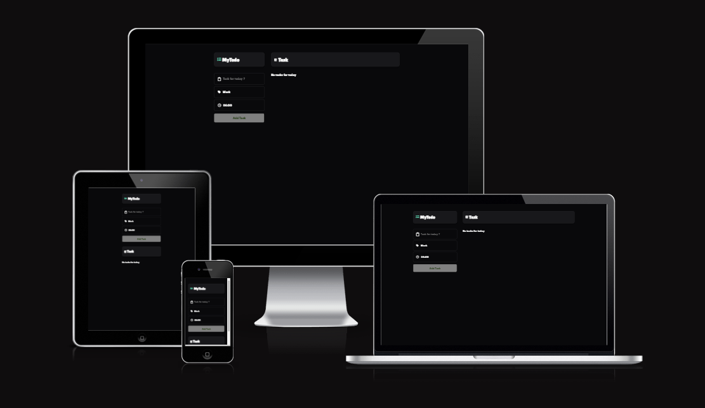
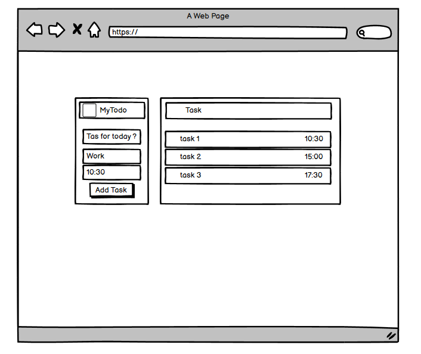
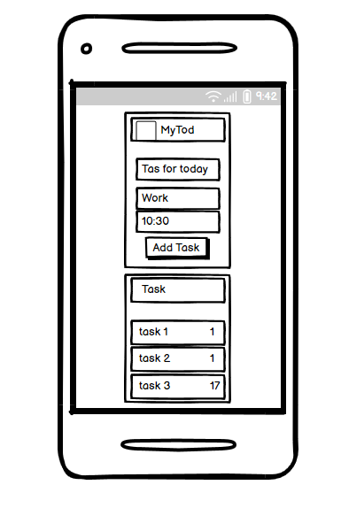
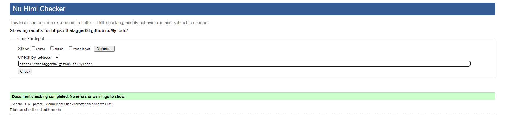
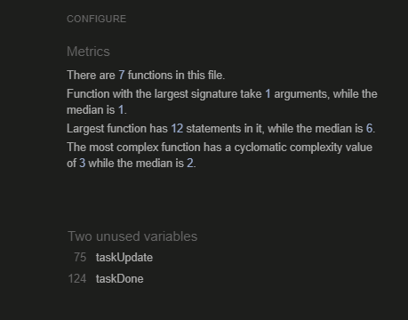
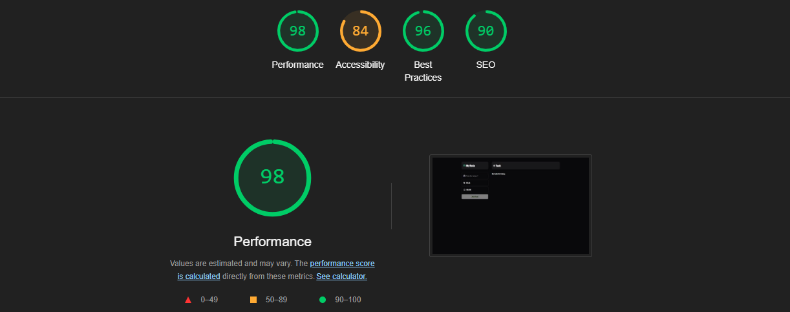

<!-- TABLE OF CONTENTS -->

Table of Contents

<!-- INTRODUCTION SECTION -->
  

  
<a href="#my_app">SECTION 1: INTRODUCTION</a>

        <li><a href='#UX'>User Experience (UX)</a></li>
        <li><a href='#user-stories'>User Stories</a></li>
    

    

    

    
<a href="#features-and-structure">SECTION 2: PROJECT FEATURES AND STRUCTURE

    <li><a href="#features">Features</a></li>
    <li><a href="#features_User">Features User Stories</a></li>
     <li><a href="#project">Project Structure</a></li>
      <li><a href="#technologies">Technologies Used</a></li>
       <li><a href="#future">Future Enhancements</a></li>
    <li><a href="#wireframes">Wireframes</a></li>

<a href="#deployment">SECTION 3: TESTING AND VALIDATION</a>

    <li><a href="#testing">Testing</a></li>
    <li><a href="#validation">Validation</a></li>

<a href="#resources">SECTION 4: DEPLOYMENT & INSTALLATION</a>

<li><a href="#demo">Demo</a></li>

<li><a href="#installation">Installation</a></li>

<a href="#resources">SECTION 5: RESOURCES</a>

<li><a href="#resources">Resources</a></li>

#

<!-- INTRODUCTION -->

<section>
<h1 id="introduction">SECTION 1: INTRODUCTION </h1>

<h2> MyTodo App </h2>

MyTodo is a simple, interactive to-do list web application that allows users to manage their daily tasks. Users can add tasks, categorize them by labels such as "Work," "Home," "Shopping," or "Urgent," and mark them as done once completed.

<h2 id="UX">User Experience (UX)</h2>

MyTodo is designed with a focus on simplicity and ease of use. The user interface is intuitive, ensuring that users can quickly add, view, and manage tasks without any unnecessary steps.

Clean Design: The app features a clean, minimalist design with a dark color scheme that is easy on the eyes. The consistent use of the "Lilita One" font adds a playful and modern feel.

Responsive Layout: The app is fully responsive, providing an optimal experience on both desktop and mobile devices. The layout adjusts seamlessly, ensuring that all functionalities are easily accessible regardless of the device used.

Interactive Elements: Visual feedback is provided for interactive elements. For example, when a task is marked as complete, the task's appearance changes, making it clear that the task is done. The use of icons and color changes helps users quickly identify different actions.

Form Interaction: The form fields are designed to be user-friendly, with clear placeholders and focus effects that guide the user through the task creation process.

Error Handling: The app includes basic error handling to prevent users from scheduling overlapping tasks. If a time conflict occurs, the user is immediately notified, allowing them to choose a different time.

Task Prioritization: By allowing users to categorize tasks by labels, MyTodo helps users prioritize their tasks visually, making it easier to focus on what matters most.

<h2 id="user-stories">User Stories</h2>

<h3>As a User:</h3>

1. Add a Task

    - As a user, I want to be able to add a new task so that I can keep track of things I need to do.
    - I want to categorize my tasks by different labels (Work, Home, Shopping, Urgent) so that I can easily manage and prioritize them.

2. View Task List

    - As a user, I want to see all my tasks listed in one place so that I can review what needs to be done today.

    - I want my tasks to be organized by time so that I can manage my day effectively.

3. Complete a Task

    - As a user, I want to mark tasks as complete so that I can track my progress.

    - I want completed tasks to be visually distinct so that I can quickly see what I have accomplished.

4. Prevent Overlapping Tasks

    - As a user, I want to be alerted if I try to schedule two tasks at the same time so that I can avoid conflicts in my schedule.

#

<h2 id="usage">Usage</h2>

1. Add a Task:

    - Enter the task name in the "Task for today?" input field.
    - Select a label (Work, Home, Shopping, Urgent).
    - Choose a time for the task.
    - Click "Add Task" to add the task to your list.

2. View Tasks:

    - All tasks will be displayed under the "Task" section.
    - Tasks are organized based on the time they are scheduled.

3. Mark a Task as Complete:

    - Check the checkbox next to a task to mark it as complete.
    - Completed tasks will display a different icon.

#

<h1 id="features-and-structure">SECTION 2: PROJECT FEATURES AND STRUCTURE</h1>

<h1 id="features">Features</h1>

- Task Management: Add tasks with specific labels and time slots.
- Task Status: Mark tasks as complete or incomplete.
- Responsive Design: Works well on both mobile and desktop devices.

#

<h1 id="features_User">Features User Stories</h1>

1. Edit a Task

    - As a user, I want to be able to edit existing tasks so that I can update or correct any details.
 
2. Delete a Task

    - As a user, I want to remove tasks that I no longer need to complete, so my task list remains relevant and up-to-date.

3. Receive Notifications

    - As a user, I want to receive notifications for my tasks so that I don’t forget to complete them.

#

<h1 id="project">Project Structure</h1>

- index.html: The main HTML file containing the structure of the app.

- style.css: The CSS file responsible for the app's styling and layout.

- script.js: The JavaScript file handling the app's functionality, such as task creation, updating, and completion.

#

<h1 id="technologies">Technologies Used</h1>

- HTML5: For structuring the web page.
- CSS3: For styling and layout.
- JavaScript: For adding interactivity to the app.

#

<h1 id="future">Future Enhancements</h1>

- Task Editing: Allow users to edit existing tasks.
- Task Deletion: Allow users to remove tasks.
- Notification System: Notify users when it's time to complete a task.

#

<h2 id="wireframes">Wireframes</h2>

#

<h1 id="testing-and-validation">SECTION 3: TESTING AND VALIDATION</h1>

<h2 id="testing">Testing</h2>

- Browser Compatibility Testing: Ensured compatibility with Chrome, Opera, Microsoft Edge, and Firefox desktop browsers.

- Responsiveness Testing: Utilized Chrome Developer Tools to verify responsiveness across multiple devices: Desktop, Laptop, Iphone 14 Pro Max, iPad Pro, Galaxy Z Fold 5.

<h2 id="validation">Validation</h2>

The W3C Markup Validator, W3C CSS Validator and JSHint Services were used to check for syntax errors and warnings in this project.

- [HTML](https://validator.w3.org/#validate_by_input)

- [CSS](https://jigsaw.w3.org/css-validator/)

- [JavaScript](https://jshint.com/)

- I used Lighthouse tools to test the website Performance (98%), Accessibility (84%), Best Practices (96%) and SEO (90%)

#

<h1 id="deployment">SECTION 4: DEPLOYMENT & INSTALLATION</h1>

<h2 id="demo">Demo</h2>

https://thelagger06.github.io/MyTodo/

<h2 id="installation">Installation</h2>

1. Clone the repository:

    <code>git clone https://github.com/your-username/mytodo.git </code>

2. Navigate to the project directory:

    <code>cd mytodo </code>

3. Open index.html in your preferred web browser:

    <code>open index.html</code>

#

<h1 id="resources">RESOURCES</h1>

https://www.cssmatic.com/box-shadow

https://www.w3schools.com/

https://www.w3schools.com/howto/howto_css_custom_checkbox.asp

https://moderncss.dev/pure-css-custom-checkbox-style/